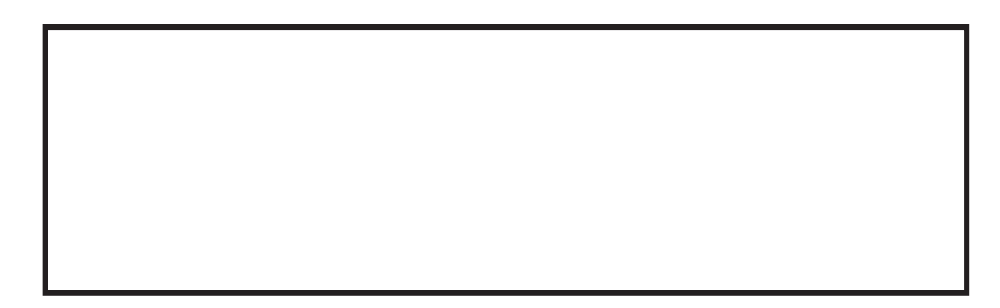
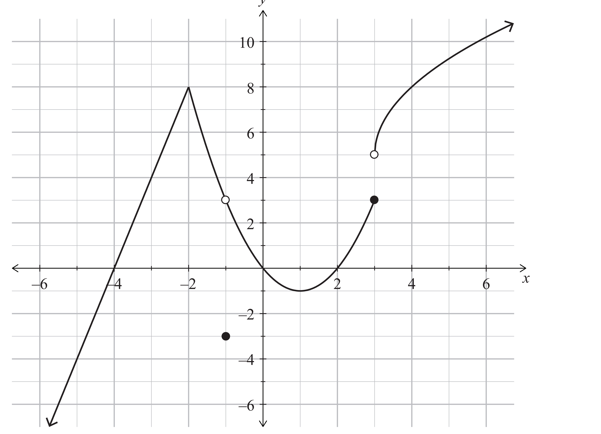
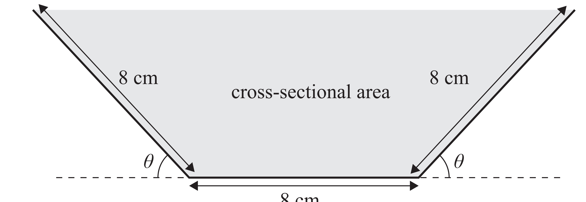

3

SUPERVISOR'S USE ONLY

# Level 3 Calculus, 2013

91578 Apply differentiation methods in solving problems 9.30am Wednesday 13 November 2013 Credits: Six

| Achievement                              | Achievement with Merit                    | Achievement with Excellence            |
|------------------------------------------|-------------------------------------------|----------------------------------------|
| Apply differentiation methods in solving | Apply differentiation methods, using      | Apply differentiation methods, using   |
| problems.                                | relational thinking, in solving problems. | extended abstract thinking, in solving |
|                                          |                                           | problems.                              |

Check that the National Student Number (NSN) on your admission slip is the same as the number at the top of this page.

You should attempt ALL the questions in this booklet.

Show ALL working.

Make sure that you have the Formulae and Tables Booklet L3–CALCF.

If you need more space for any answer, use the page(s) provided at the back of this booklet and clearly number the question.

Check that this booklet has pages 2–12 in the correct order and that none of these pages is blank.

# You Must Hand This Booklet To The Supervisor At The End Of The Examination.

© New Zealand Qualifications Authority, 2013. All rights reserved.

No part of this publication may be reproduced by any means without the prior permission of the New Zealand Qualifications Authority.

ASSESSOR'S USE ONLY

## 91578

You are advised to spend 60 minutes answering the questions in this booklet. 

### Question One

(a) Differentiate y = tan(x2 + 1).

You do not need to simplify your answer.

(b) Find the gradient of the tangent to the function f(x) = ln(3x - ex) at the point where x = 0.

(c) Find the x values of any points of inflection on the graph of the function y = e(6 - x 2).

	 Show any derivatives that you need to find when solving this *problem.*
2

(d) A curve is defined by the parametric equations:

 x = 5sint and y = 3tant Find the gradient of the normal to the curve at the point where t = π3
.

	 Show any derivatives that you need to find when solving this *problem.*
3 Calculus 91578, 2013 4
(e) A closed cylindrical tank is to have a surface area of 20 m2.

Find the radius the tank needs to have so that the volume it can hold is as large as possible.

	 You do not have to prove that your solution gives the maximum *volume.* Show any derivatives that you need to find when solving this *problem.*
Calculus 91578, 2013

### Question Two

(a) Differentiate y = π − x 3 2 .

You do not need to simplify your answer.

(b) A curve has the equation y = (x*3 - 2*x)
3.

Find the equation of the tangent to the curve at the point where x = 1.

	 Show any derivatives that you need to find when solving this *problem.*
(c) For what value of k does the function f x = − xx ( ) - ex k have a stationary point at x = –1?

	 Show any derivatives that you need to find when solving this *problem.*
5 Calculus 91578, 2013 6
(d) The graph below shows the function y = f(x).

y
For the function *f(x)* above:
(i) Find all the value(s) of x that meet each of the following conditions:
1. f'(x) = 0 2. f''(x) < 0 3. f(x) is not differentiable
(ii) What is the value of f (–1)?

(iii) What is the value of lim f x( )? x→3 State clearly if the value does not exist. 

Calculus 91578, 2013
(e) A copper sheet of width 24 cm is folded, as shown, to make spouting.

Cross-section:

8 cm

Find angle θ which gives the maximum cross-sectional area. You do not need to prove that you have found a maximum.

	 Show any derivatives that you need to find when solving this *problem.*
7 Calculus 91578, 2013

### Question Three

$$\mathrm{~all~}$$
sin(2 )
(a) Differentiate y x

$$v=\frac{v_{11}}{v_{11}}$$

2 = .

$\blacksquare$
$$\mathbf{a}$$
x You do not need to simplify your answer.

$$r-2$$

(b) For the function f x xx
( ) 162
= + − , find the x-values of any stationary points.

	 You must use calculus and clearly show your working, including any derivatives you *need* to find when solving this *problem.*
8 Calculus 91578, 2013 9
(c) Find the value of x that gives the maximum value of the function f(x) = 50x - 30x ln2x
	 You do not need to prove that your value of x gives a maximum. You must use calculus and clearly show your working, including any derivatives you need to find when solving this *problem.*
Calculus 91578, 2013 10
(d) A curve is defined by the parametric equations:

 x = t 2 - t and y = t 3 - 3t Find the coordinates of the point(s) on the curve for which the normal to the curve is parallel to the y-axis.

	 You must use calculus and clearly show your working, including any derivatives you need to find when solving this *problem.*
Calculus 91578, 2013 11
(e) A spherical balloon is being inflated with helium. 

The balloon is being inflated in such a way that its volume is increasing at a constant rate of 300 cm3 s–1. 

The material that the balloon is made of is of limited strength, and the balloon will burst when its surface area reaches 7500 cm2.

Find the rate at which the surface area of the balloon is increasing when it reaches bursting point.

	 Show any derivatives that you need to find when solving this *problem.*

Calculus 91578, 2013

QUESTION 
NUMBER
Extra paper if required.

Write the question number(s) if applicable.

ASSESSOR'S 
USE ONLY

| 8                    | 7   |
|----------------------|-----|
| 5                    | 1   |
| 9                    |     |
| Calculus 91578, 2013 |     |

12